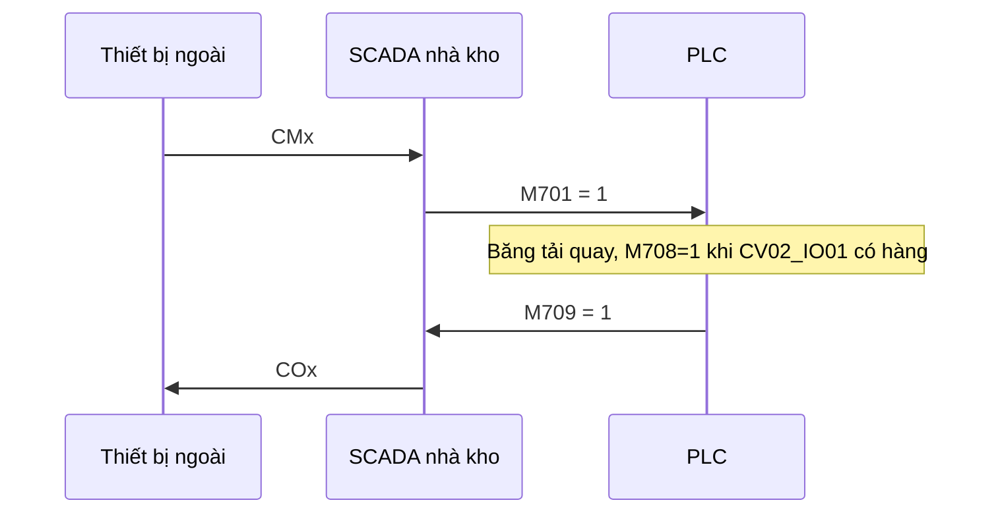
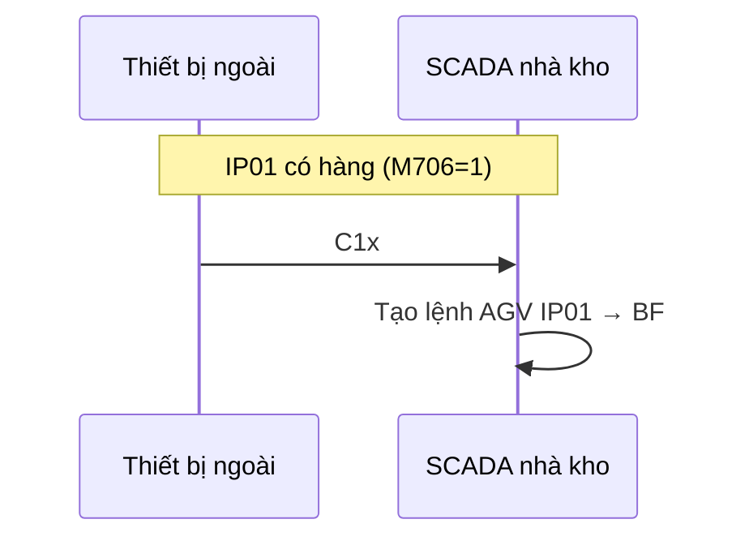
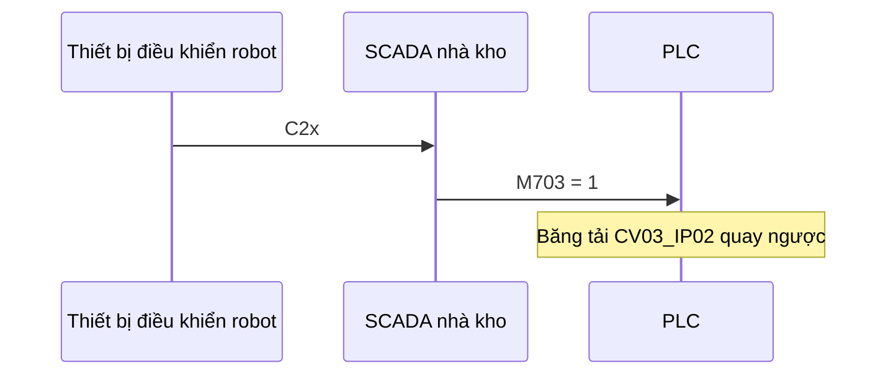

# Tài liệu hệ thống Smart Warehouse Management System (SWM)

**Phiên bản:** theo mã nguồn hiện tại
**Nền tảng:** WPF .NET Framework 4.8
**PLC:** Mitsubishi (thư viện ActUtlType)

---

## 1. Tổng quan

Phần mềm SCADA quản lý kho thông minh, điều phối AGV và băng tải qua PLC, đồng bộ trạng thái ô kho (BF) với SQL Server, giao tiếp thiết bị nhận dạng qua cổng serial.

### Luồng dữ liệu chính

```
Serial / HMI / Thủ công
        ↓
TransportCommandService (tạo & quản lý lệnh)
        ↓
PlcService (ghi/đọc tag PLC)
        ↓
PlcMonitorService (poll 2s, cập nhật tiến độ)
        ↓
UI (map kho, AGV, panel trạng thái)
```

### Cấu trúc solution

| Project | Vai trò |
|---------|---------|
| `SWM.UI` | Giao diện WPF, services điều phối |
| `SWM.BL` | Business logic (layout, lệnh, báo cáo) |
| `SWM.DL` | Truy cập database |
| `SWM.Common` | Model dùng chung (AGV, TransportCommand, InventoryAging) |

---

## 2. Cấu hình

File: `SWM.UI/config/appsettings.json` (copy ra `bin/Debug/config/` khi build).

| Section | Tham số | Mô tả |
|---------|---------|-------|
| `Database` | `ConnectionString` | Chuỗi kết nối SQL Server |
| `Plc` | `IpAddress` | IP PLC (ping kiểm tra mạng) |
| `Plc` | `StationNumber` | Logical station ActUtlType |
| `Serial` | `PortName` | Cổng COM (vd. COM23) |
| `Serial` | `BaudRate` | Tốc độ baud (vd. 115200) |
| `Warehouse` | `AgvId`, `StkId` | ID AGV và kho |
| `Warehouse` | `InputPortName` / `InputPortId` | Cổng nhập IP01 (mặc định ID `215`) |
| `Warehouse` | `OutputPortName` / `OutputPortId` | Cổng xuất OP01 (mặc định ID `115`) |

Đọc cấu hình: `AppConfiguration.Load()` trong `App.xaml.cs`.

---

## 3. Giao tiếp Serial

**Định dạng tin:** nội dung + hậu tố `x` (vd. gửi `CM` → trên dây là `CMx`).
**Đọc tin:** đọc đến ký tự `x`, bỏ `x` rồi xử lý.

### Bảng lệnh serial

| Tin | Hướng | Ý nghĩa | Hành động phần mềm |
|-----|-------|---------|-------------------|
| `C1x` | Nhận | Lấy hàng lên kho | Tạo lệnh nhập IP01 → ô BF trống đầu tiên |
| `CMx` | Nhận | Quay băng tải CV02 | Ghi **M701 = 1**, chờ **M709 = 1** rồi gửi **COx** |
| `C2x` | Nhận | Quay ngược CV03_IP02 | Ghi **M703 = 1** |
| `COx` | Gửi | Xác nhận sẵn sàng cho robot | Gửi khi **M709 = 1** (sau khi **M708** báo có hàng) |

Phần mềm **không** thực hiện nhận dạng — chỉ nhận lệnh từ thiết bị ngoài qua serial.

### Luồng quay băng tải (CM / CO)



### Luồng lấy hàng lên kho (C1)



### Luồng quay ngược băng tải CV03_IP02 (C2)



**Lưu ý luồng C2:**

- Lệnh **độc lập** với CM/CO và C1 — không gửi phản hồi serial, không chờ sensor.
- Chỉ thực hiện khi PLC đã kết nối; nếu chưa kết nối → báo trạng thái trên panel Serial, không ghi M703.
- Mỗi lần nhận **C2x** đều ghi lại **M703 = 1** (PLC xử lý reset/tắt theo logic riêng).

**Lưu ý chung serial:** **C1**, **CM** và **C2** là ba lệnh độc lập:

| Lệnh | Tác dụng |
|------|----------|
| `CM` | Quay băng tải CV02 (M701), trả COx khi M709=1 |
| `C1` | Tạo lệnh AGV nhập kho IP01 → BF |
| `C2` | Quay ngược băng tải CV03_IP02 (M703) |

Điều kiện tạo lệnh nhập (`CreateImportCommand`):

1. PLC **M706 = 1** (IP01 có hàng).
2. Còn ít nhất một ô BF trống trong database.

Nếu không đủ điều kiện → hiển thị cảnh báo, không tạo lệnh.

---

## 4. Giao tiếp PLC — Bảng tag

### Đọc (PLC → PC)

| Tag | Ý nghĩa |
|-----|---------|
| `M706` | IP01 có hàng (=1) / trống (=0) |
| `M708` | CV02_IO01 có hàng (=1) — cảm biến báo có hàng |
| `M709` | Cờ PLC (=1) — SCADA gửi COx khi ON |
| `M707` | OP01 có hàng (=1) / trống (=0) |
| `M510` | AGV có hàng (=1 FULL) / trống (=0 EMPTY) |
| `D800` | Vị trí AGV thô; nếu > 4 thì trừ 4 để map node trên sơ đồ |
| `M3000` | Hoàn thành lệnh (=1); PLC giữ ON đến khi PC gửi **M39** (lệnh mới) |
| `M33` | Yêu cầu xuất từ HMI PLC |
| `D2500` | Mã cảnh báo |
| `M845` | Nhịp sống (PC ghi xen kẽ 0/1) |

### Ghi (PC → PLC)

| Tag | Ý nghĩa |
|-----|---------|
| `M701` | Quay băng tải CV02_IP01 (=1 khi nhận CMx) |
| `M703` | Quay ngược băng tải CV03_IP01 (=1 khi nhận C2x) |
| `M39` | Cờ gửi lệnh AGV: 0 → ghi D502/D500 → 1, **5s về 0**; PLC reset **M3000** |
| `D502` | Loại lệnh: **1** = IP01→BF, **2** = BF→OP01 |
| `D500` | ID ô BF (đích khi nhập, nguồn khi xuất) |
| `M33` | Reset về 0 sau khi SCADA đã tạo lệnh xuất |
| `M845` | Alive pulse (0.5s) |

> Tag `D2100` / `D2150` (nguồn/đích chi tiết) hiện **chưa ghi** trong code — chỉ dùng `D502` + `D500`.

---

## 5. Lệnh vận chuyển AGV

Chỉ hỗ trợ **2 loại**:

| Loại | D502 | D500 | Mô tả |
|------|------|------|-------|
| Nhập | 1 | BFID đích | IP01 → ô BF trống |
| Xuất | 2 | BFID nguồn | Ô BF đầy → OP01 |

Không hỗ trợ: IP→OP trực tiếp, di chuyển nội bộ BF↔BF.

### Nguồn tạo lệnh

| Nguồn | Cách kích hoạt |
|-------|----------------|
| Serial | `C1x` → nhập |
| PLC HMI | `M33` tăng giá trị → xuất ô FULL đầu tiên |
| Thủ công | Manual Control: chọn IP01→BF hoặc BF→OP01 |
| (Tự động) | Timer 2s xử lý hàng đợi `JOB CREATE` |

### Vòng đời lệnh

```
JOB CREATE → JOB START → TRANSFERING DEST → JOB COMPLETE
```

| Trạng thái | Điều kiện chuyển |
|------------|------------------|
| `JOB CREATE` | AGV ở node 0 hoặc 1 → gán lệnh, ghi PLC → `JOB START` |
| `JOB START` | AGV tới node nguồn (map từ D800) → `TRANSFERING DEST`, nguồn → EMPTY |
| `TRANSFERING DEST` | AGV tới node đích **hoặc** M3000 cạnh lên 0→1 (sau M39) → `JOB COMPLETE`, đích → FULL |

### Điều kiện hủy lệnh (JOB CREATE)

Lệnh bị xóa tự động khi AGV ở node 0/1 và:

- Không map được loại lệnh (nguồn/đích không hợp lệ), **hoặc**
- Nguồn đã **EMPTY**, **hoặc**
- Lệnh nhập mà đích BF đã **FULL**

Hủy thủ công: chỉ khi trạng thái còn `JOB CREATE`.

---

## 6. Chu kỳ timer

| Timer | Chu kỳ | Chức năng |
|-------|--------|-----------|
| Command | 2s | `ProcessPendingCommands()` — gán & đẩy lệnh lên PLC |
| PLC Monitor | 2s | `PlcMonitorService.Poll()` — AGV, IP/OP, alarm, M33, tiến độ JOB |
| PLC Alive | 0.5s | Toggle `M845` |
| Network ping | 5s | Ping IP PLC, cập nhật panel kết nối |

---

## 7. Giao diện chính

### Dashboard map

- Ô BF: xanh nhạt = trống, xanh đậm = đầy.
- Hiển thị thời gian tồn kho (`InventoryAging`) chỉ trên ô **FULL**.
- CV02 / CV03: ẩn header cổng (`HidePortHeader`).

### Panel SYSTEM MONITOR (bên phải)

- Trạng thái PLC, Serial, Database.
- Serial: cổng COM, baud, trạng thái CM/CO gần nhất.

### Manual Control

Chỉ cho phép:

- **IP01 → ô BF** (nhập)
- **Ô BF → OP01** (xuất)

---

## 8. Services (SWM.UI/Services)

| File | Trách nhiệm |
|------|-------------|
| `PlcService.cs` | Kết nối ActUtlType, `StartConveyorRotation` (M701), `StartCv03Ip02ReverseRotation` (M703) |
| `ConveyorCommandService.cs` | CMx → M701, M709 → COx; C2x → M703 |
| `SerialCommunicationService.cs` | COM port, parse C1/CM/C2 |
| `TransportCommandService.cs` | CRUD lệnh, tiến độ JOB, nhập/xuất |
| `PlcMonitorService.cs` | Poll PLC định kỳ |
| `ConnectionStatusService.cs` | Tổng hợp trạng thái kết nối cho UI |
| `WarehouseConstants.cs` | Đọc section Warehouse từ JSON |

---

## 9. Database

Catalog mặc định: `SmartWarehouse` trên `.\SQLExpress`.

Bảng / view chính (qua BL/DL):

- `NA_R_BF_INFORMATION` — trạng thái ô kho
- `NA_R_VEHICLE` / `NA_R_NODE` — AGV và vị trí
- Bảng lệnh vận chuyển (qua `BLTransportCommand`)

---

## 10. Triển khai & vận hành

### Yêu cầu

- Windows + .NET Framework 4.8
- SQL Server Express (hoặc tương thích)
- Mitsubishi MX Component / ActUtlType đã cài
- Cổng COM cho thiết bị nhận dạng

### Khởi động

1. Chỉnh `config/appsettings.json` (PLC IP, COM, connection string).
2. Build solution `SmartWarehouseManagermentSystem.sln`.
3. Chạy `SWM.UI.exe` — tự kết nối PLC và mở serial khi khởi động.

### Kiểm tra nhanh

| Kiểm tra | Kỳ vọng |
|----------|---------|
| Panel PLC | Online, ping OK |
| Panel Serial | COM mở thành công |
| Gửi CMx | M701=1, chờ M709=1 rồi nhận COx |
| Gửi C2x | M703=1 (quay ngược CV03_IP02) |
| IP01 có hàng + C1x | Tạo lệnh JOB CREATE |
| M33 trên PLC | Tạo lệnh xuất |

---

## 11. Sơ đồ tổng hợp luồng nhập hàng

```
[Thiết bị ngoài gửi CMx]
      │
      ▼
  SCADA set M701=1
      │
      ▼
  Chờ M708=1 (có hàng tại CV02_IO01)
      │
      ▼
  Chờ M709=1 ──► gửi COx
      │
      │ (băng tải đưa hàng tới IP01, M706=1)
      ▼
[Thiết bị ngoài gửi C1x]
      │
      ▼
  Tạo lệnh IP01→BF
      │
      ▼
  AGV JOB CREATE → START → TRANSFERING → COMPLETE
      │
      ▼
  Ô BF FULL, cập nhật DB + UI
```

## 12. Luồng quay ngược CV03_IP02 (C2)

```
[Thiết bị điều khiển robot gửi C2x]
      │
      ▼
  SCADA set M703=1
      │
      ▼
  PLC quay ngược băng tải CV03_IP02
      (không gửi phản hồi serial)
```

---

## 13. Thay đổi / mở rộng thường gặp

| Nhu cầu | Vị trí chỉnh |
|---------|--------------|
| Đổi cổng COM | `appsettings.json` → Serial |
| Đổi IP PLC | `appsettings.json` → Plc |
| Thêm tin serial mới | `SerialCommunicationService.ProcessMessage` |
| Đổi tag PLC | `PlcService`, `PlcMonitorService`, `TransportCommandService` |
| Reset M701 sau khi băng tải xong | `PlcService` — cần tag/điều kiện từ PLC (chưa có trong code hiện tại) |
| Reset M703 sau khi quay ngược xong | `PlcService` / `ConveyorCommandService` — cần tag/điều kiện từ PLC (chưa có trong code hiện tại) |

---

*Tài liệu sinh từ mã nguồn dự án SWM — cập nhật khi có thay đổi tag PLC hoặc giao thức serial.*
